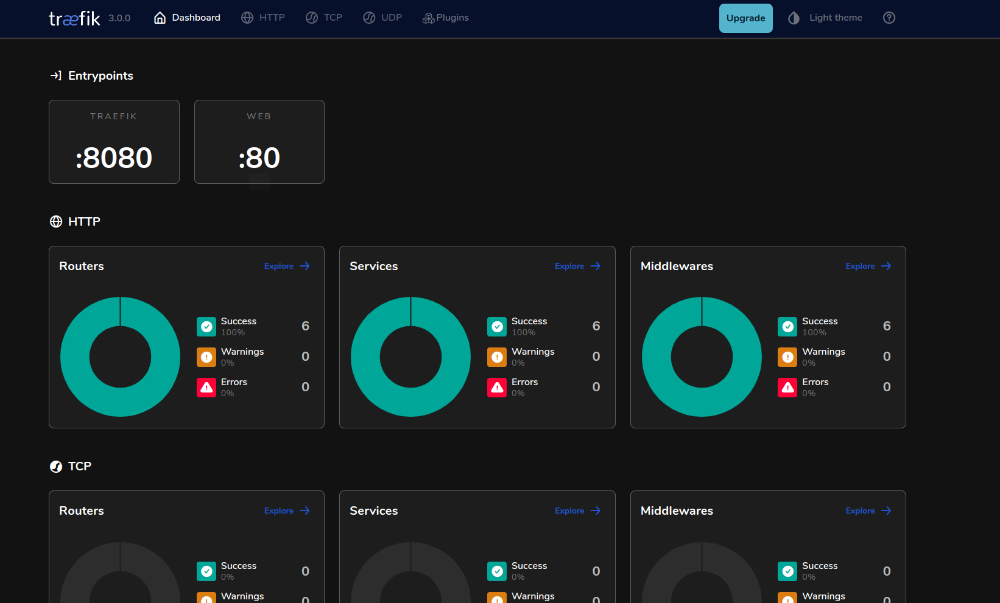

# Partner API Gateway

This project serve as a reverse proxy. All partner api call will pass through this proxy. All the necessary Authentication/Authorization will handle this server to get data from partner API. You just need to configure appropriate `x-api-key` and `x-partner` header and this proxy will handle all the necessary processing.

To learn more. Please visit <a href="https://doc.traefik.io/traefik/">Traefik</a>

## Example:

### CURL request of Booking:
```shell 
curl --location 'http://apigateway.travelai.com/param1/param2?query_strings' \
--header 'x-api-key: your-api-key' \
--header 'x-partner: booking' \
--header 'Content-Type: appropriate-content-type' \
--data '{
    "created": {
    "from": "2024-05-01T04:29:00+00:00",
    "to": "2024-05-02T09:31:00+00:00"
    },
    "currency": "EUR",
    "maximum_results": 100
}'
```

### CURL request of Partnerize:
```shell 
curl --location 'http://apigateway.travelai.com/param1/param2?query_strings' \
--header 'x-api-Key: your-api-key' \
--header 'x-partner: partnerize'
```

### CURL request of Hotel Planner:
```shell 
curl --location 'http://apigateway.travelai.com/param1/param2?query_strings' \
--header 'x-api-key: your-api-key' \
--header 'x-partner: hotelplanner' \
--header 'Content-Type: application/json' \
--data '{
    "reportType": "individual",
    "purchasedDateStart": "2024-05-01T23:59:59.999-05:00",
    "purchasedDateEnd": "2024-05-02T23:59:59.999-05:00",
    "returnType": "json"
}'
```
## Logging
### Access log
Traefik provide access log. To enable this you need to set static configuration. Traefik manage its access log through third partly tool `logrotate`. you need to setup logrotate in your host machine. To learn more. Please visit <a href="https://doc.traefik.io/traefik/observability/access-logs/">Access Logs</a>.

Create a file where logrotate config will store.

```
nano /etc/logrotate.d/traefik
```
<b>Note:</b> Need Super User Access

Insert the following sample config to the file (you may change the file size and rotate count to tune access log file size chunk):
```
/var/log/traefik/access_logs/*.log {
    size 10M
    missingok
    rotate 5
    dateext
    dateformat .%Y-%m-%d-%H:%M:%S
    nocompress
    create
    postrotate
        docker kill --signal="USR1" gateway
    endscript
}
```
If you want to persist log and store in your host machine. Then just mount a path using following flag while run the container.

```shell
-v /path_to_host_access_log_dir:/var/log/traefik/access_logs
```

### Error log
Traefik also provide error logs. To enable this feature you need to set static configuration. If you want to persist log and store in your host machine. Then just mount a path using following flag while run the container. To learn more. Please visit <a href="https://doc.traefik.io/traefik/observability/logs/">Log</a>.

```shell
-v /path_to_host_error_log_dir:/var/log/traefik/error_logs
```

## Prepare your project

#### Configuration

Run following command and set your desired configuration.

```
git clone https://code.lefttravel.com/vrs/backend/partner-api-gateway.git
cd partner-api-gateway
cp traefik/dynamic_config.yml.example dynamic_config.yml
cp traefik/traefik.yml.example traefik.yml
```
**Please make sure below things before deployment:**
 * Check if log *filePath* and accessLog *filePath* are exist (you can modify manually) in **traefik.yml**.
 * Check whether **dynamic_config.yml** configured with **x-api-key**, **x-partner** and partners header or authentications.


#### Deployment (Production)

You can easily build docker and deploy:

```
bash deployment.sh
```

### In case you want it to do it by manually

#### Build Docker Image 
    
```shell 
docker build -t traefik . 
```
#### Run Docker Container
    
```shell
docker run -d -p 4050:8080 -p 3050:80 -v $PWD/traefik/traefik.yml:/etc/traefik/traefik.yml
-v $PWD/traefik/dynamic_config.yml:/etc/traefik/dynamic_config.yml
-v /path_to_host_log_dir:/var/log/traefik/access_logs
-v /path_to_host_log_dir:/var/log/traefik/error_logs
--restart=unless-stopped
--name gateway traefik
```

Traefik listens on port 80 for HTTP, port 443 for HTTPS, and provides a monitoring dashboard on port 8080. Expose the necessary ports based on your requirements for external access through proxy services and the dashboard, while considering security best practices.

### Monitoring Dashboard:
<div align="center">
    
</div>
